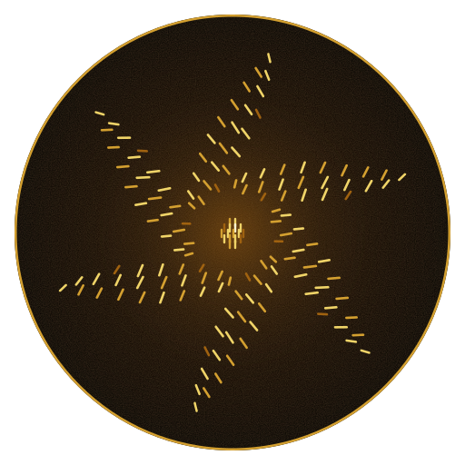
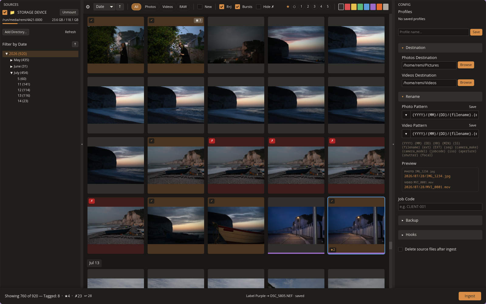
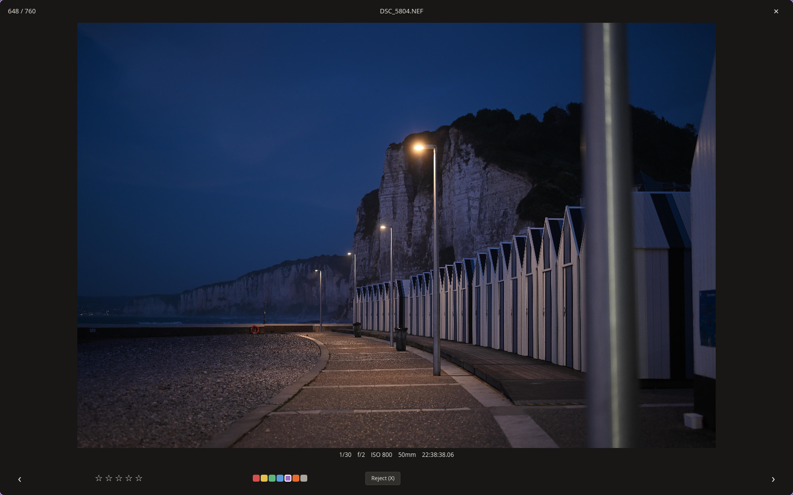
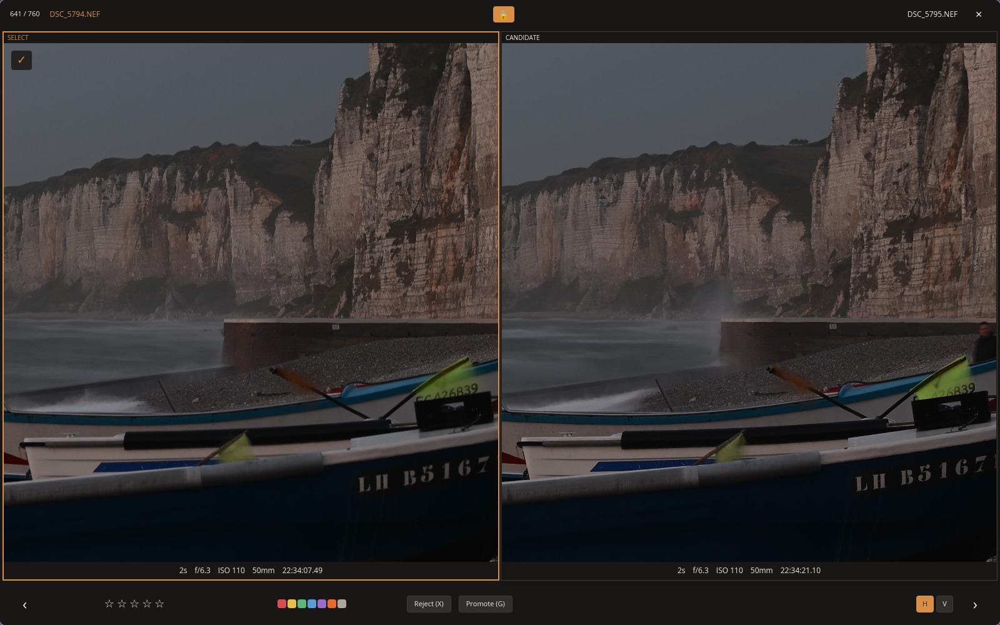

<p align="center">
  
</p>

<h1 align="center">Ferrocull</h1>

<p align="center">
  Cull thousands of frames on deadline.<br>
  Open source, keyboard-driven, Photo Mechanic shortcuts.
</p>

<p align="center">
  <a href="https://github.com/ferrocull/ferrocull/actions/workflows/ci.yml"></a>
  <a href="./LICENSE"></a>
</p>



## What it does

**Culling.** A contact sheet of the whole card, star ratings and color labels on the number keys, tagging to build up the selection, RAW and JPEG shown as one item, bursts detected and collapsed to a single frame, and a full-screen preview that carries the same shortcuts.



Compare mode puts two frames side by side and locks zoom and pan together.



**Ingest.** Copy from a card or a folder to a primary destination plus as many backups as you want, renamed by pattern, verified with SHA256, videos routed somewhere of their own, post-copy hooks, and XMP sidecars written on the way out.

Shortcuts and vocabulary follow Photo Mechanic, so there is nothing to relearn. Press `?` in the app for the full list.

## How it compares

Ferrocull is a culling tool, so these are the tools worth comparing it against.

- [Photo Mechanic](https://home.camerabits.com/) is the tool Ferrocull is modelled on. Proprietary.
- [FastRawViewer](https://www.fastrawviewer.com/) does RAW-first culling with focus peaking and exposure aids. Proprietary.
- [Narrative Select](https://narrative.so/select) and [AfterShoot](https://aftershoot.com/) cull with AI assistance: blink detection, focus scoring, duplicate grouping. Proprietary.

None of them run on Linux. None of them are open source.

A few open source projects cover part of the same ground. [PhotoSort](https://github.com/duartebarbosadev/PhotoSort) culls with blur detection and near-duplicate grouping and writes XMP, but does not ingest. [Facet](https://github.com/ncoevoet/facet) scores and culls into XMP as well, as a local web app rather than a native one. [CullSnap](https://github.com/Abhishekmitra-slg/CullSnap) does import from cards, but keeps ratings in its own database instead of XMP. None of them put keyboard-first culling, XMP sidecars and verified ingest in one native application, which is the gap Ferrocull aims at.

## Status

Alpha. There are no tagged releases yet, so Ferrocull is built from source. It is developed and used on Linux and macOS.

What is not there yet:

- RAW previews come from the JPEG the camera embedded in the file. That makes a card load fast, and the cost is that zoom stops where the camera's preview stops.
- Videos are copied and renamed on ingest, but they are not thumbnailed and they do not play.
- Tethered cameras are detected and listed as sources, but they cannot be scanned or ingested from yet.
- Windows is untested. There is a device backend for it, nothing more.
- It is not a digital asset manager and not an editor, by design.

Everything in flight is on the [issue tracker](https://github.com/ferrocull/ferrocull/issues).

## Install

Ferrocull builds against Rust nightly, which `rust-toolchain.toml` pins for you, plus two native libraries: libgphoto2 and libjpeg-turbo 3 or newer.

Watch the libjpeg-turbo version: several distributions still ship 2.1, which is too old. Arch and Fedora carry 3.x; on Debian and Ubuntu you may need the upstream release, which is what [CI](.github/workflows/ci.yml) installs.

### Linux

```sh
sudo apt install libgphoto2-dev      # or your distribution's equivalent
make install prefix=$HOME/.local
```

That builds the release binary and installs it with a desktop entry and hicolor icons, so Ferrocull appears in the application launcher. `prefix` follows the GNU install layout, so `sudo make install` puts it in `/usr/local` instead. Build as your own user: `make install` refuses to compile under `sudo`, which would leave root-owned artifacts in `target/`.

The per-user install needs `~/.local/bin` on your `PATH`. `PREFIX` works as an alias for `prefix`, and the usual `bindir` and `datadir` overrides are honoured. `make uninstall` takes the same variables and removes what was installed.

Packagers can stage the tree with `make install prefix=/usr DESTDIR=$pkgdir`. `DESTDIR` also suppresses the desktop and icon cache refresh.

### macOS

```sh
brew install libgphoto2 jpeg-turbo
cargo build --release
./target/release/ferrocull
```

There is no application bundle yet, so copy the binary somewhere on your `PATH` and launch it from a terminal.

### Packages

There are none yet.

## Development

Written in Rust, which by tradition requires calling it blazingly fast.

| Crate               | What it is                                                          |
| ------------------- | ------------------------------------------------------------------- |
| `ferrocull`         | binary entry point                                                  |
| `ferrocull-core`    | the culling engine: ingest, copy and verify, caches, metadata store |
| `ferrocull-media`   | media file types and extension categorization                       |
| `ferrocull-devices` | device and volume discovery, one backend per platform               |
| `ferrocull-ui`      | the iced UI                                                         |

The UI follows The Elm Architecture on [iced](https://iced.rs/).

Setting up, running the tests and the pre-push gate are covered in [CONTRIBUTING.md](CONTRIBUTING.md).

## Built to be read by agents

The markdown in this repository is the shared understanding humans and coding agents work from. If you point an agent at Ferrocull, point it at these first:

| File                       | What it holds                                              |
| -------------------------- | ---------------------------------------------------------- |
| [`AGENTS.md`](AGENTS.md)   | the rules code in this repository follows                  |
| [`CONTEXT.md`](CONTEXT.md) | the glossary: what burst, select, or paired file mean here |
| [`PRODUCT.md`](PRODUCT.md) | who Ferrocull is for and what it refuses to become         |
| [`DESIGN.md`](DESIGN.md)   | the visual system, down to the color tokens                |
| [`docs/adr/`](docs/adr/)   | why the significant calls were made                        |

The workflow around them is built on [mattpocock/skills](https://github.com/mattpocock/skills).

## Contributing

Bug reports, feature requests and pull requests are all welcome. [CONTRIBUTING.md](CONTRIBUTING.md) covers getting set up, the pre-push gate, and what a mergeable pull request looks like.

## Trademarks

Photo Mechanic is a trademark of Camera Bits, Inc. Ferrocull is an independent project, not affiliated with, sponsored by, or endorsed by Camera Bits. The name is used only to describe where Ferrocull's keyboard shortcuts and vocabulary come from.

## License

[Apache-2.0](./LICENSE). The bundled fonts carry their own licenses, listed in [THIRD-PARTY-NOTICES.md](./THIRD-PARTY-NOTICES.md).
